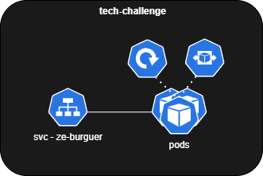

# Tech Challenge FIAP

Aplicação responsável pela gestão de pedidos da hamburgueria Zé do Burguer via totem de auto atendimento.

## Oficial Image

[Docker Image](https://hub.docker.com/repository/docker/marcosilva/ze_burguer/general)

## Documentação

[DDD](https://miro.com/app/board/uXjVMjkFsPU=/?share_link_id=958233804889)

[Arquitetura](#arquitetura)

[Stack](#stack-utilizada)

[Instalação Docker](#instalação)

[Instalação Kubernetes](#instalação-k8s)

[APIs](#documentação-da-api)

---

## Arquitetura

### Clean Architecture


### Estrutura do projeto

- doc
- infra: Módulo responsável pela gestão da infra e configurações externas utilizadas na aplicação. Ex: Migrations, docker, config.go
- kustomize: Módulo responsável pela gestão dos arquivos kubernetes
- src
	- **External**: Módulo responsável por realizar a recepção dos dados e realizar a chamada para a controller
		- **Handler**: Camada responsável por definir o meio de recepção das requisições; ex: REST API, GraphQL, Mensageria
        - **Database**: Camada onde realizamos a configuração do banco de dados;
		- **Repository**: Camada responsável por realizar a integração com o banco de dados ; Ex: MySQL, PostgreSQL, DynamoDB, etc;
		- **Service**: Camada responsável por realizar a integração com serviços externos; Ex: Integração com mercado pago, integração com serviços AWS, etc;
    - **Controller**: Módulo responsável por realizar a validação dos dados e realizar a chamada para as UseCases necessárias
		- **Controller**: Camada responsável por realizar a validação dos dados e realizar a chamada para as UseCases necessárias;
		- **Serializer**: Camada responsável por definir o **Input** e **Output** da API;
    - **Application**: Módulo responsável pelo coração do negócio
        - **Modules**: Camada responsável pelos responses do **Service**; 
        - **Contract**: Camada responsável por definir as interfaces de **Service** e **Repository**;
        - **UseCases**: Camada responsável pela implementação da regra de negócio;
	- **Entities**: Módulo responsável pela definição das entidades da aplicação
        - **Entity**: Camada responsável pela definição das entidades que o sistema vai utilizar; Ex: Pedido, cliente
        - **Enum**: Camada responsável por definir os enums utilizados pelo negócio. Ex: Status do pedido, status do pagamento

---

## Stack utilizada

**Linguagem:** Go lang (v1.21)

**Banco de dados:** PostgreSQL

**Ambiente:** Docker v24.0.5 | Docker-compose v2.20.2

**Kubernetes:** V1.27.2

---

## Instalação Docker

Clone o projeto

```bash
  git clone https://github.com/ViniAlvesMartins/tech-challenge-fiap.git
```

Entre no diretório do projeto

```bash
  cd tech-challenge-fiap
```

Crie o arquivo `.env` apartir do `.env.example`

```bash
  cp .env.example .env
```

Inicie a aplicação

```bash
  docker-compose up
```
## Instalação Kubernetes

Requisitos Cluster Kubernetes:

- Docker Kubernetes
- Metrics Server (Instalado)
	- [Guia de instalação Cluster](https://github.com/kubernetes-sigs/metrics-server?tab=readme-ov-file#installation)

Requisitos Criação dos Recursos:

- Kubectl 
	[Guia de instalação local](https://kubernetes.io/docs/tasks/tools/)

Para criar os recursos 

```bash
  kubectl apply -k kustomize/
```

Com a execução acima será criado a seguinte infraestrutura:

Services
 - ze-burguer: NodePort 30443
 - postgres: ClusterIP 5432

Deployments
 - ze-burguer: HPA (2-5 Pods) - CPU Average Usage metrics
 - postgres: 1 Pod



## Documentação da API

[Collection_Insomnia](./doc/apis/insomnia.json)
#### Base URL: http://localhost:8080

#### Domains:
[Cliente](#cliente)

[Produto](#produto)

[Pedido](#pedido)

### Cliente

#### Cadastro de Cliente

```http
  POST /client
```

| Parâmetro   |   Tipo    | Local     | Descrição                           |
| :---------- | :-------  | :---------| :---------------------------------- |
| cpf         |   string  | body      | **Obrigatório**. O CPF do cliente   |
| name        |   string  | body      | **Obrigatório**. O nome do cliente  |
| email       |   string  | body      | **Obrigatório**. O email do cliente |

#### Response

```http
StatusCode: 200
Response: {
	"MessageError": "",
	"Data": {
		"id": 48,
		"cpf": 19034721801,
		"name": "cliente1",
		"email": "cli1ent1a22@teste.com"
	}
}
```
```http
StatusCode: 409
Response: {
	"MessageError": "Client already exists",
	"Data": null
}

```

#### Consulta de Cliente por CPF

```http
  GET /client
```

| Parâmetro   |   Tipo    | Local     | Descrição                           |
| :---------- | :-------  | :---------| :---------------------------------- |
| cpf         |   string  | Query     | **Obrigatório**. O CPF do cliente   |

#### Response

```http
StatusCode: 200
Response: {
	"MessageError": "",
	"Data": {
		"id": 48,
		"cpf": 19034721801,
		"name": "cliente1",
		"email": "cli1ent1a22@teste.com"
	}
}
```
```http
StatusCode: 404
Response: {
	"MessageError": "Not found",
	"Data": null
}
```

### Produto

##### Enum de categoria
| Id | Nome           |
| :- | :------------- |
|  1 | Lanche         |
|  2 | Bebida         |
|  3 | Acompanhamento |
|  4 | Sobremesa      |

#### Cadastro de Produto

```http
  POST /product
```

| Parâmetro   |   Tipo    | Local     | Descrição                           |
| :---------- | :-------  | :---------| :---------------------------------- |
| name_product|   string  | Body      | **Obrigatório**. O nome do produto  |
| description |   string  | Body      | **Obrigatório**. A descrição do produto |
| price       |   decimal | Body      | **Obrigatório**. O preço do produto |
| category_id |   number  | Body      | **Obrigatório**. A categoria do produto   |

#### Response

```http
StatusCode: 201
Response: {
	"MessageError": "",
	"Data": {
		"id": 23,
		"name_product": "teste",
		"description": "descricao teste",
		"price": 10,
		"category_id": 2,
		"active": true
	}
}
```

```http
StatusCode: 400
Response: {
	"Errors": [
		{
			"Field": "Price",
			"Message": "required"
		}
	]
}
```

```http
StatusCode: 404
Response: {
	"MessageError": "Category not found",
	"Data": null
}
```

#### Consulta de Produto por categoria

```http
  GET /category/{category_id}/product
```

| Parâmetro   |   Tipo    | Local     | Descrição                           |
| :---------- | :-------  | :---------| :---------------------------------- |
| category_id |   number  | pathParam | **Obrigatório**. O códgio da categoria  |

#### Response

```http
StatusCode: 200
Response: {
	"MessageError": "",
	"Data": [
		{
			"id": 3,
			"name_product": "batata frita",
			"description": "quente",
			"price": 5,
			"category_id": 3,
			"active": true
		},
		{
			"id": 6,
			"name_product": "nuggets",
			"description": "quente",
			"price": 7,
			"category_id": 3,
			"active": true
		}
	]
}
```

```http
StatusCode: 404
Response: {
	"MessageError": "Category Not found",
	"Data": null
}
```

```http
StatusCode: 404
Response: {
	"MessageError": "Product Not found",
	"Data": null
}
```

#### Edição de Produto

```http
  PUT /product/{product_id}
```

| Parâmetro   |   Tipo    | Local     | Descrição                           |
| :---------- | :-------  | :---------| :---------------------------------- |
| product_id  |   number  | pathParam | **Obrigatório**. O códgio do produto|

#### Response

```http
StatusCode: 200
Response: {
	"MessageError": "",
	"Data": {
		"id": 6,
		"name_product": "teste",
		"description": "descricao teste",
		"price": 10,
		"category_id": 1,
		"active": true
	}
}
```

```http
StatusCode: 404
Response: {
	"MessageError": "Not found",
	"Data": null
}
```

```http
StatusCode: 400
Response: {
	"Errors": [
		{
			"Field": "NameProduct",
			"Message": "required"
		},
		{
			"Field": "Description",
			"Message": "required"
		},
		{
			"Field": "Price",
			"Message": "required"
		}
	]
}
```

#### Delete de Produto

```http
  DELETE /product/{product_id}
```

| Parâmetro   |   Tipo    | Local     | Descrição                           |
| :---------- | :-------  | :---------| :---------------------------------- |
| product_id  |   number  | pathParam | **Obrigatório**. O códgio do produto|

#### Response

```http
StatusCode: 200
Response: {}
```

```http
StatusCode: 404
Response: {
	"MessageError": "Not found",
	"Data": null
}
```

### Pedido

#### Criação de pedido

```http
  POST /order
```

| Parâmetro   |   Tipo       | Local     | Descrição                           |
| :---------- | :-------     | :---------| :---------------------------------- |
| client_id   |   number     | body      | O código do cliente                 |
| products    |list(products)| body      | **Obrigatório**. Lista de produtos  |

#### Exemplo da lista de produtos

```http
"products": [
        {
            "id": 2
        },
        {
            "id": 5
        }
    ]
```

#### Response

```http
StatusCode: 200
Response: {
	"MessageError": "",
	"Data": {
		"id": 10,
		"client_id": null,
		"status_order": "AWAITING_PAYMENT",
		"amount": 6,
		"created_at": "2023-10-31T22:50:08.853088Z",
		"products": [
			{
				"id": 2,
				"name_product": "suco de laranja",
				"description": "gelado",
				"price": 2.5,
				"category_id": 2,
				"active": true
			},
			{
				"id": 5,
				"name_product": "suco de limão",
				"description": "gelado",
				"price": 3.5,
				"category_id": 2,
				"active": true
			}
		]
	}
}
```
```http
StatusCode: 404
Response: {
	"MessageError": "Product not found 563",
	"Data": null
}

```

```http
StatusCode: 400
Response: {
	"MessageError": "Product is required",
	"Data": null
}
```
