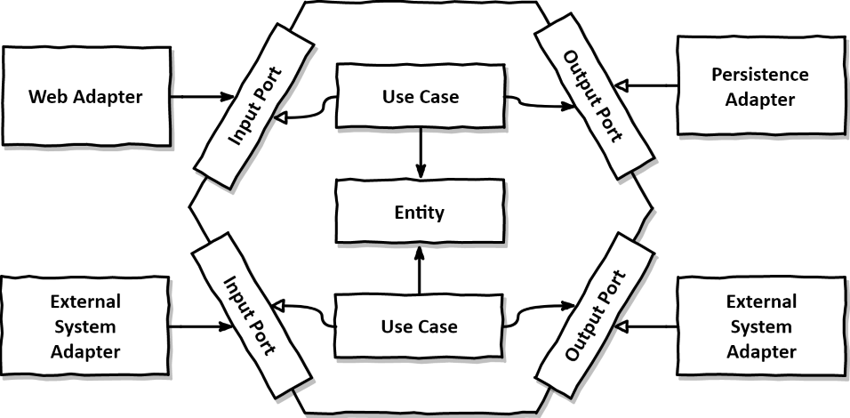

# Tech Challenge FIAP

Aplicação responsável pela gestão de pedidos da hamburgueria Zé do Burguer via totem de auto atendimento.

## Documentação

[DDD](https://link-da-documentação)

[Arquitetura](#arquitetura)

[Stack]()

[Instalação]()

[APIs]()

## Arquitetura

### Hexagonal

### Estrutura do projeto

- doc 
- infra
- src
    - **Adapter**: Módulo responsável por realizar a recepção e armazenamento de dados, e a integração com sistemas ou serviços de terceiros
        - **Inbound**
            - **Controller**: Camada responsável por processar a validação dos dados e direcionar a requisição para o serviço;
            - **Handler**: Camada responsável por definir o meio de recepção das requisições; ex: REST API, GraphQL, Mensageria
        - **Outbound**: Camada onde realizamos a implementação das ports **repository** e **external**
            - **Repository**: Camada responsável por realizar a integração com o banco de dados; Ex: MySQL, PostgreSQL, DynamoDB
            - **External**: Camada responsável por realizar a integração com sistema ou serviços de terceiros; Ex: Integração com Mercado Pago, Integração com Mensageria
    - **Core**: Módulo responsável pelo coração do negócio
        - **Domain**: Camada responsável pelas entidades do negócio; 
        - **Port**: Camada responsável por definir as interfaces de **Service**, **Repository** e **External**;
        - **Service**: Camada responsável pela implementação da regra de negócio;
